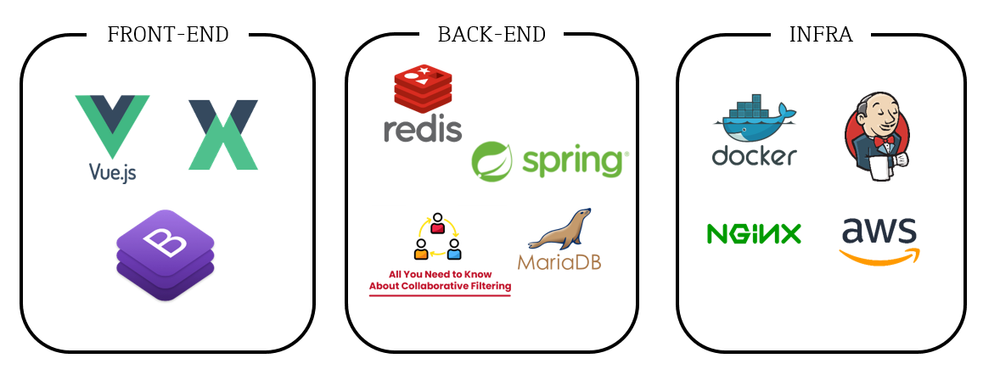

# :clapper: 편집 :house:

**편**하게 **집**에서 의뢰하자! 라는 취지에서 만든 프로젝트, 편집입니다!

## :hammer_and_wrench: 기술 스택



## :card_file_box: 프로젝트 구조

```
📁backend
├── 📁src
│   ├── 📁main
│   │   ├── 📁java/com/web/editor
│   │   │   ├── 📁config
│   │   │   ├── 📁controller
│   │   │   │   ├── 📁email
│   │   │   │   ├── 📁google
│   │   │   │   ├── 📁kakao
│   │   │   │   ├── 📁request
│   │   │   │   └── 📁user
│   │   │   ├── 📁model
│   │   │   │   ├── 📁dto
│   │   │   │   ├── 📁mapper
│   │   │   │   ├── 📁response
│   │   │   │   └── 📁service
│   │   │   └── MainApplication
│   │   └── 📁resources
│   └── 📁test
📁frontend/
└── 📁src
    ├── 📁assets
    ├── 📁components
    │   ├── 📁NotificationPlugin
    │   └── 📁SidebarPlugin
    ├── 📁layout
    ├── 📁plugins
    ├── 📁store
    ├── 📁util
    ├── 📁views
    │   ├── 📁Dashboard
    │   ├── 📁Error
    │   ├── 📁Portfolio
    │   ├── 📁Search
    │   └── 📁Tables
    └── App
```


## :building_construction: 아키텍처

### SW 아키텍처


## :triangular_flag_on_post: 기능

#### **<회원가입>**

1. 사이트 회원가입
   - Editor/Non-Editor 선택
   - Nickname입력 : 기존의 유저와 Nickname 중복되는 경우 체크
   - Email입력 :
     - 이메일 형식이 아닐 경우, 인증 버튼 비활성화 
     - 인증번호 요청을 통해 Email계정으로 인증번호를 받고 인증
     - 기존의 유저와 Email 중복되는 경우 체크
   - password입력 : 8자 이상 숫자, 문자 1개 이상으로 조합으로 가능
   - password확인 : password입력과 동일해야함

#### **<로그인>**

1. 사이트 로그인
   - Email, password 입력 시 로그인 가능
     - email 형식 아닐 경우, 하단에 알림 메시지를 보이게 함
     - Email or password 틀렸을 경우, 하단에 알림 메시지를 보이게 함
   - 소셜 로그인(google)
     - 기존에 가입되어 있는 email이 google인 경우 google 소셜로그인으로 간편 로그인 가능

#### **<회원정보 수정>** - 우측 상단 자신의 **닉네임** 클릭 후, **내 정보**

1. Nickname 수정
   - Nickname 변경 : 기존의 유저와 Nickname 중복되는 경우 변경 불가능
2. 회원 탈퇴
   - 탈퇴하기 : 탈퇴하기 후, 탈퇴한 계정으로 로그인 불가능

#### **<메인 페이지>**
1. 슈퍼 편집자 추천
   - 실제 사용자들의 평점을 기반, 평점 순으로 슈퍼편집자를 추천
2. 맞춤 편집자 추천
   - 사용자의 찜 리스트 데이터를 기반으로 개인별 맞춤 편집자를 추천
   - 비로그인 사용자의 경우 제공 불가


#### **<검색>**

1. **작업 요청서** 작성하여 검색 - 메인의 맞춤 편집자 찾기 버튼
   - 편집 목적, 영상 종류, 편집 스킬, 원본 길이, 완성 길이, 희망 기한 선택
   - 요청서 작성을 기반으로 필터 된 검색 결과 보여짐
   - 이름 / 평점 / 낮은 가격 / 높은 가격 순으로 정렬 가능
   - 검색된 포트폴리오 리스트 클릭 시, 포트폴리오 상세페이지 보여짐
   - 하트 누를 시, 나의 찜 목록에 추가
2. **일반 검색** – 페이지 좌측 메뉴 바 & 메인의 전체 편집자 보기 버튼
   - 영상 목적, 영상 종류, 편집 기술 선택하여 검색 가능(필터 적용, 전체 해제 가능)
   - 검색어 입력 시 편집자 이름으로 검색 가능 (태그 기준으로도 검색 가능)
   - 이름 / 평점 / 낮은 가격 / 높은 가격 순으로 정렬 가능
   - 검색된 포트폴리오 리스트 클릭 시, 포트폴리오 상세페이지 보여짐
   - 하트 누를 시, 나의 찜 목록에 추가
3. **태그 검색** - 편집자의 옵션에 있는 태그 버튼
   - 클릭된 태그가 검색어에 자동 입력되어 검색 됨
   - 검색된 포트폴리오 리스트 클릭 시, 포트폴리오 상세페이지 보여짐
   - 하트 누를 시, 나의 찜 목록에 추가
#### **<작업 요청 하기>** - 포트폴리오 상세페이지에서 우측 상단 **작업 요청하기** 버튼

1. 작업 요청서 작성 : 작업 기간, 영상 길이 등의 상세 정보 작성 후, 요청하기

2. 요청 완료 : 
   - 비편집자: 알람 페이지의 요청한 작업에서 확인 가능
   - 편집자: 알람 페이지의 요청된 작업에서 확인 가능

#### **<알람>** \- 페이지 좌측 메뉴 바 알람 클릭, 페이지 우측 상단 종 모양 알람 클릭

1. 알람 확인 : 우측 상단 알람을 통해 알람이 온 것을 확인 가능(확인하지 않은 알람 카운트), 알람 페이지로 이동해 알람을 확인하면 확인하지 않은 알람 개수 갱신

2. 캘린더 확인 : 캘린더를 통해 선택된 작업, 진행중 작업(작업이 진행 중이면 자동 update), 개인 일정(포트폴리오에서 등록했던 개인 일정 update) 등 확인 가능

3. 요청된 작업 : 
   - 비 편집자 : 요청 들어온 작업을 작업 요청서와 함께 확인 가능, 요청 수락 시 진행중 작업으로 이동, 요청 거절 시 작업 삭제됨
   - 편집자 : 요청한 작업을 작업 요청서와 함께 확인 가능, 요청 취소 시 요청 작업 삭제됨

4. 진행중 작업 :
   - 비 편집자 : 진행중인 작업을 작업 요청서와 함께 확인 가능
   - 편집자 : 진행중인 작업을 작업 요청서와 함께 확인 가능, 요청 완료 시 완료된 작업으로 이동

5. 완료된 작업 : 
   - 비편집자: 
     - 완료된 작업을 작업 요청서와 함께 확인 가능
     - 후기 기능 (후기는 편집자의 포트폴리오 상세 페이지에 반영)
       - 완료된 작업에 편집자에 대한 후기 작성 기능
         - 영상 만족도/ 편집자 친절도/ 작업 기한 마감/ 한 줄 평
       - 후기 작성 완료시, 본인이 작성한 후기 볼 수 있는 기능
       - 본인이 작성한 후기, 삭제 기능
   - 편집자: 완료된 작업을 작업 요청서와 함께 확인 가능

#### **<포트폴리오 작성>** - 페이지 좌측 메뉴 바 포트폴리오 클릭

1. 대표영상 및 기타영상 등록 : 영상 url입력 후 수정하기 클릭, 포트폴리오 페이지에 영상으로 보여짐
2. 상세 정보 등록 : 강점, 페이 가격 등 상세 정보 입력 후 수정하기 클릭, 포트폴리오 페이지에 영상으로 보여짐
3. 캘린더 설정 : 근무 불가능한 날짜 설정 후 수정하기 클릭, 포트폴리오 페이지에 보여짐
4. 평점: 포트폴리오의 편집자와 작업했던 사람들이 남긴 평점들의 평균을 볼 수 있음
5. 후기: 포트폴리오의 편집자와 작업했던 사람들이 남긴 한줄평을 볼 수 있음

#### **<찜 페이지>** - 페이지 좌측 메뉴 바 찜 클릭

1. 찜 리스트 : 포트폴리오 페이지에서 하트를 누르면 찜리스트에서 조회 가능
2. 상세 조회 : 항목을 누르면 포트폴리오 상세페이지로 이동
3. 찜 리스트 삭제 : 삭제 버튼 누르면 찜리스트에서 조회 불가능